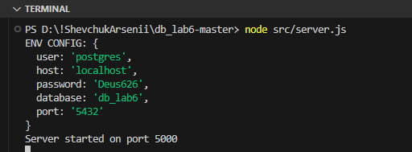
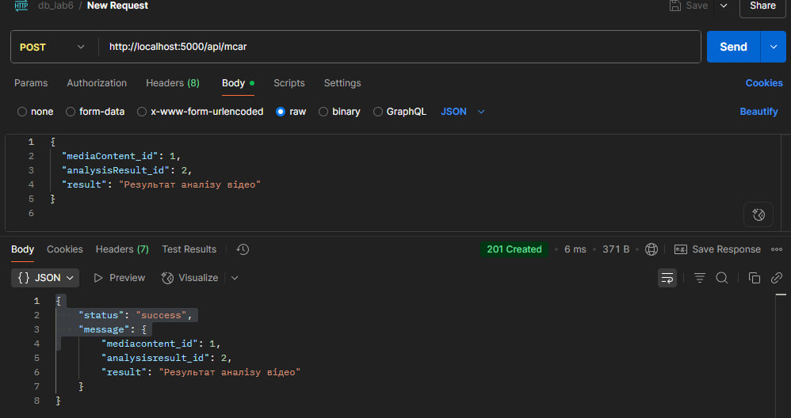
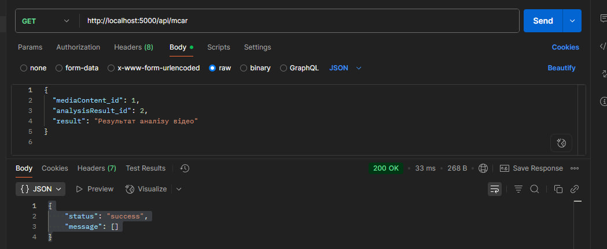
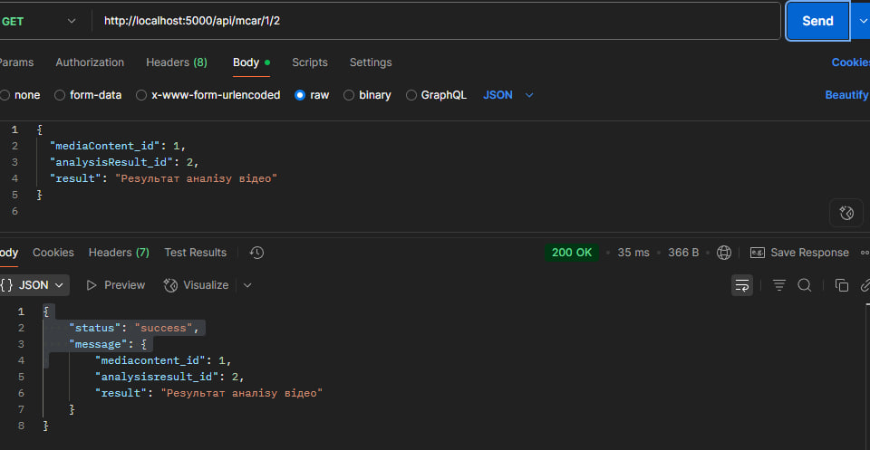
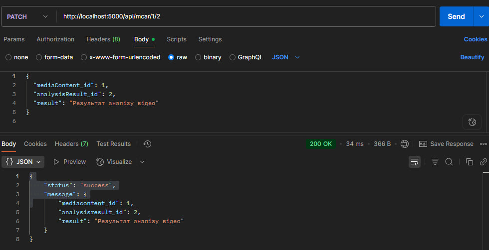
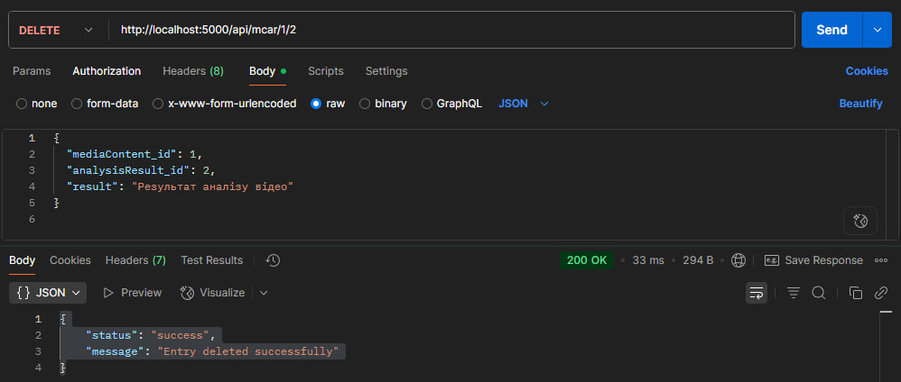

# Тестування працездатності системи

Тестування сервісу проводилося за допомогою додатку Postman.

## Запуск сервера

## POST api/mediaContentAnalysisResult

## GET api/mediaContentAnalysisResult

## GET api/mediaContentAnalysisResult/:id/:id

## PATCH api/mediaContentAnalysisResult/:id/:id

## DELETE api/mediaContentAnalysisResult/:id/:id

